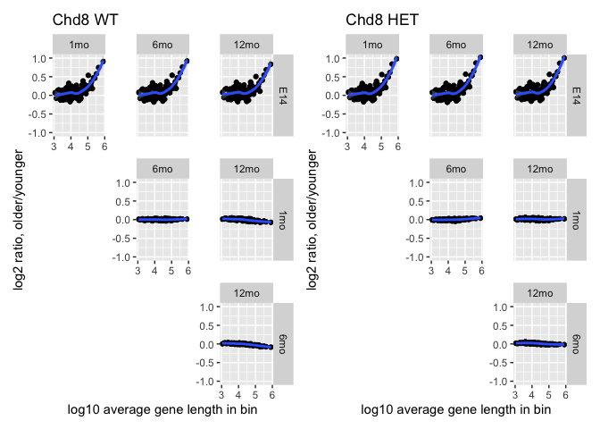

Exploration of gene expression changes in the cortex as a function of
mouse age
================

# Summary

The aim here is to create a series of plots a la [King et al
2013](https://www.nature.com/articles/nature12504) and [Mabb et al
2016](https://journals.plos.org/plosone/article?id=10.1371/journal.pone.0156439)
showing how gene expression changes as a function of gene length.

Here we will use data from [Jimenez et al
2020](https://molecularautism.biomedcentral.com/articles/10.1186/s13229-020-00369-8)
to explore whether gene expression changes coincide with the age of the
animal and whether those effects are exacerbated in Chd8 heterozygotes.

We retrieve the data directly from GEO as published, gene lengths as
annotated by [GENCODE
vM25](https://www.gencodegenes.org/mouse/release_M25.html), and bin
genes into groups of 200 based on their length. We aggregate biological
replicate expression values by taking their mean per gene and per
condition. Then within each bin, we compute and plot the mean
log2-fold-change (older vs younger) in expression relative to the mean
gene length, plotted on a log10 scale.

We compare the ages as follows:

-   E14.5 vs 1 month
-   E14.5 vs 6 months
-   E14.5 vs 12 months
-   1 month vs 6 months
-   1 month vs 12 months
-   6 months vs 12 months

We plot this once for Chd8 WT, then for Chd8 HET animals.

# Load libraries

``` r
library(tidyverse)
library(plyranges)
library(ggh4x)
library(patchwork)
```

# Import in matrix from earlier paper directly from GEO, summarizing by taking average per Genotype and Age grouping

``` r
GSE142208.summarized <- read_tsv("https://ftp.ncbi.nlm.nih.gov/geo/series/GSE142nnn/GSE142208/suppl/GSE142208_Chd8_WT_HET_VST_normCounts_matrix.txt.gz") %>%
    dplyr::rename("Gene" = ...1) %>%
    pivot_longer(cols=!Gene,names_to="Sample",values_to="Expression") %>%
    separate(Sample,c("Chd8","Genotype","Age","Rep"),sep="_",remove=F) %>%
    unite("Genotype",c(Chd8,Genotype),sep="_") %>%
    group_by(Genotype,Age,Gene) %>%
    summarize(Mean = mean(Expression)) %>%
    unite("Sample",c(Genotype,Age),sep="_") 
```

    ## New names:
    ## Rows: 24444 Columns: 49
    ## ── Column specification
    ## ─────────────────────────────────────────────────────────────────────────────────────────────────────────────── Delimiter: "\t" chr
    ## (1): ...1 dbl (48): Chd8_HET_12mo_Rep1, Chd8_HET_12mo_Rep2, Chd8_HET_12mo_Rep3, Chd8_HET_12mo_Rep4, Chd8_HET_12mo_Rep5,
    ## Chd8_HET_12mo_Rep6, C...
    ## ℹ Use `spec()` to retrieve the full column specification for this data. ℹ Specify the column types or set `show_col_types = FALSE` to
    ## quiet this message.
    ## `summarise()` has grouped output by 'Genotype', 'Age'. You can override using the `.groups` argument.
    ## • `` -> `...1`

# Download gene annotation and compute gene lengths, taking max length per gene symbol

``` r
options(timeout = max(300, getOption("timeout")))
gtf <- read_gff("https://ftp.ebi.ac.uk/pub/databases/gencode/Gencode_mouse/release_M25/gencode.vM25.annotation.gtf.gz")
lengths <- gtf %>%
    group_by(gene_name) %>% 
    summarize(Max = max(width)) %>% 
    as_tibble() %>%
    dplyr::rename("Gene" = gene_name, "Length" = Max)
```

# Restrict lengths and expression dataset to common set of gene symbols

``` r
intersect <- intersect(lengths$Gene,GSE142208.summarized$Gene)
GSE142208.summarized.inter <- GSE142208.summarized %>%
    dplyr::filter(Gene %in% intersect)

lengths.inter <- lengths %>%
    dplyr::filter(Gene %in% intersect)
```

# Bin genes into groups of 200 by length

Uses solution from [this post](https://stackoverflow.com/a/27626007)

``` r
chunk <- function(x, n) (mapply(function(a, b) (x[a:b]), seq.int(from=1, to=length(x), by=n), pmin(seq.int(from=1, to=length(x), by=n)+(n-1), length(x)), SIMPLIFY=FALSE))
z <- chunk(lengths.inter$Gene[order(lengths.inter$Length,decreasing=T)],200)
names(z) <- paste0("Chunk",seq(1:length(z)))

genes.chunked <- stack(z) %>% 
    as_tibble() %>%
    dplyr::rename("Gene" = values, "Chunk" = ind)
```

# Plot samples comparing each age pairwise per genotype

``` r
design <- "
  ABC
  #DE
  ##F
"

wt <- inner_join(GSE142208.summarized.inter,lengths.inter,by="Gene") %>%
    inner_join(genes.chunked,by="Gene") %>%
    mutate(LogLength = log10(Length+1)) %>%
    pivot_wider(names_from=Sample,values_from=Mean) %>%

    # WT
    ## Compute ratios relative to E14.5
    mutate(WT.Ratio_1mo_vs_E14 = Chd8_WT_1mo - Chd8_WT_E14.5) %>%
    mutate(WT.Ratio_6mo_vs_E14 = Chd8_WT_6mo - Chd8_WT_E14.5) %>%
    mutate(WT.Ratio_12mo_vs_E14 = Chd8_WT_12mo - Chd8_WT_E14.5) %>%

    ## Compute ratios relative to 1mo
    mutate(WT.Ratio_6mo_vs_1mo = Chd8_WT_6mo - Chd8_WT_1mo) %>%
    mutate(WT.Ratio_12mo_vs_1mo = Chd8_WT_12mo - Chd8_WT_1mo) %>%

    ## Compute ratios relative to 6mo
    mutate(WT.Ratio_12mo_vs_6mo = Chd8_WT_12mo - Chd8_WT_6mo) %>%   

    # Compute average ratio for each gene chunk 
    dplyr::select(Gene,Length,Chunk,LogLength,contains("Ratio")) %>%
    pivot_longer(cols=contains("Ratio"),names_to="Comparison",values_to="Ratio") %>%
    separate(Comparison,c("Genotype","Comparison"),sep="\\.") %>%
    mutate(Comparison = str_replace_all(Comparison,"Ratio_","")) %>%
    group_by(Chunk,Comparison,Genotype) %>%
    summarize(MeanRatio = mean(Ratio,na.rm=T),MeanLength = mean(LogLength,na.rm=T),n = dplyr::n()) %>%
    dplyr::filter(MeanLength > 3) %>%
    separate(Comparison,c("A","vs","B"),sep="_") %>%
    dplyr::select(-vs) %>%
    ggplot(aes(x=MeanLength,y=MeanRatio)) +
    geom_point() +
    geom_smooth() +
    coord_cartesian(ylim=c(-1, 1)) +
    xlab("log10 average gene length in bin") +
    ylab("log2 ratio, older/younger") +
    ggh4x::facet_manual(fct_relevel(B,c("E14","1mo","6mo"))~fct_relevel(A,c("1mo","6mo","12mo")),design = design,strip = strip_split(c("right", "top"))) +
    ggtitle("Chd8 WT")
```

    ## `summarise()` has grouped output by 'Chunk', 'Comparison'. You can override using the `.groups` argument.

``` r
het <- inner_join(GSE142208.summarized.inter,lengths.inter,by="Gene") %>%
    inner_join(genes.chunked,by="Gene") %>%
    mutate(LogLength = log10(Length+1)) %>%
    pivot_wider(names_from=Sample,values_from=Mean) %>%

    # HET
    ## Compute ratios relative to E14.5
    mutate(HET.Ratio_1mo_vs_E14 = Chd8_HET_1mo - Chd8_HET_E14.5) %>%
    mutate(HET.Ratio_6mo_vs_E14 = Chd8_HET_6mo - Chd8_HET_E14.5) %>%
    mutate(HET.Ratio_12mo_vs_E14 = Chd8_HET_12mo - Chd8_HET_E14.5) %>%

    ## Compute ratios relative to 1mo
    mutate(HET.Ratio_6mo_vs_1mo = Chd8_HET_6mo - Chd8_HET_1mo) %>%
    mutate(HET.Ratio_12mo_vs_1mo = Chd8_HET_12mo - Chd8_HET_1mo) %>%

    ## Compute ratios relative to 6mo
    mutate(HET.Ratio_12mo_vs_6mo = Chd8_HET_12mo - Chd8_HET_6mo) %>%    

    # Compute average ratio for each gene chunk 
    dplyr::select(Gene,Length,Chunk,LogLength,contains("Ratio")) %>%
    pivot_longer(cols=contains("Ratio"),names_to="Comparison",values_to="Ratio") %>%
    separate(Comparison,c("Genotype","Comparison"),sep="\\.") %>%
    mutate(Comparison = str_replace_all(Comparison,"Ratio_","")) %>%
    group_by(Chunk,Comparison,Genotype) %>%
    summarize(MeanRatio = mean(Ratio,na.rm=T),MeanLength = mean(LogLength,na.rm=T),n = dplyr::n()) %>%
    dplyr::filter(MeanLength > 3) %>%
    separate(Comparison,c("A","vs","B"),sep="_") %>%
    dplyr::select(-vs) %>%
    ggplot(aes(x=MeanLength,y=MeanRatio)) +
    geom_point() +
    geom_smooth() +
    coord_cartesian(ylim=c(-1, 1)) +
    xlab("log10 average gene length in bin") +
    ylab("log2 ratio, older/younger") +
    ggh4x::facet_manual(fct_relevel(B,c("E14","1mo","6mo"))~fct_relevel(A,c("1mo","6mo","12mo")),design = design,strip = strip_split(c("right", "top"))) +
    ggtitle("Chd8 HET")
```

    ## `summarise()` has grouped output by 'Chunk', 'Comparison'. You can override using the `.groups` argument.

# Plot

    ## `geom_smooth()` using method = 'loess' and formula = 'y ~ x'
    ## `geom_smooth()` using method = 'loess' and formula = 'y ~ x'

    ## RStudioGD 
    ##         2

``` r
wt + het
```

    ## `geom_smooth()` using method = 'loess' and formula = 'y ~ x'
    ## `geom_smooth()` using method = 'loess' and formula = 'y ~ x'

<!-- -->
